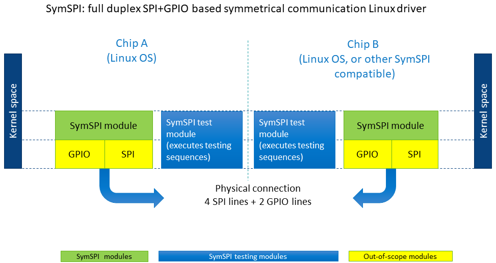
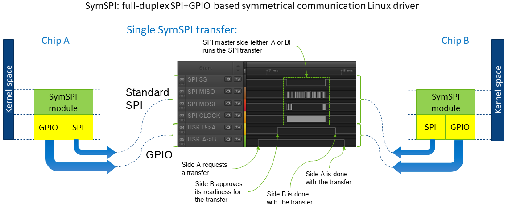
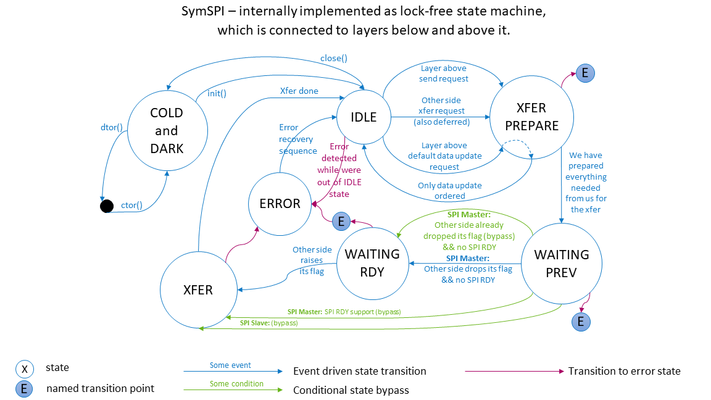
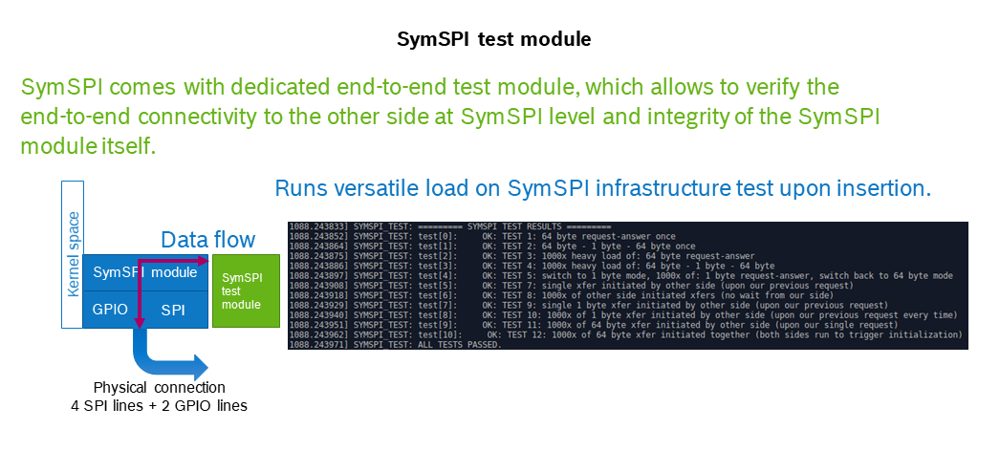

# What is it?

SymSPI is a Linux data transport driver, whish provides
symmetrical full-duplex communication between two chips
using SPI bus and two GPIO flag lines.

Symmetrical is in sence that either of two communication
sides can trigger the bi-directional data tranfer over
SymSPI no matter which SPI role it plays.

Here it is a very complicated =) graph of location of
the SymSPI module within the kernel:

# What is it for?

SymSPI is aimed to provide a data transport between
two active parties (both can send and request data
on their own).

Such use case can occur when a device has, say, two active
chips both running Linux OS(or compatible). One of them
runs safety critical part of software and the other runs
the rest of services, which still need to communicate with
the safe domain. In this case SymSPI can naturally be used as a
basis for symmetrical communication between first and second
chip/OS.

SymSPI is light-weight so its counterparts can be implemented
also on other memory-restricted realtime OSes (say, like
Autosar OS implementation).

SymSPI has a relatively low latency - one can estimate 
that from transfer request till transfer start not more than
500us usually pass (mainline kernel estimation).

# What problem it solves

Let's take two chips which both play active role in a device,
and both run Linux OS. Now, let's assume that both communication
sides need actively initiate the data exchange with the other side
(it can be event sending from side A to side B, and commands sending
from B to A, etc.).

Then one either need to poll a passive SPI side from active SPI side
(which is not really a graceful solution under most use cases when
data flow is not really high), or to implement some facility on the
GPIO basis which will allow passive SPI side to ask SPI active side
to initiate data transfer.

SymSPI is the solution to this situation: any side will trigger a
data exchange transfer by calling `symspi_data_xchange(...)` routine
and then just wait for "transfer done" callback.

# How does it look like

## In Hardware

SymSPI uses
* 2 unidirectional GPIO lines (one from every side)
  as status/request indication lines (flag lines).
* Standard SPI bus (4+ lines) to run the data exchange itself.

## From Protocol perspective

A side asserts its flag line when it wants to initiate the data
transfer or approve the initiate request from the other side.

A side de-asserts its flag line when it is done with current
SPI transfer and ready for the next one.

Flag remains asserted from data transfer request/response till the
time when a side is done with current transfer and ready for the next
one.

A minimal flag down time `T_down` is configurable due to requirements
of the circuity and counterpart hardware.

If a side detects some error condition (like: unexpected transfer
size, unexpected flag line change, error indication from the other side,
buffer allocation failure,  etc), then it triggers following flag line
sequence:
* de-assert, wait `T_down` us
* assert, wait `T_down` us
* de-assert, wait `T_down` us
* assert, wait `T_down` us
* de-assert, wait `T_down` us

and then goes into error state for configurable time `T_error`
in which there is no reaction on any external signals.
After `T_error` time passed normal communication flow is reestablished.

OK, it is probably better to look once instead of reading, here it is
(the normal, non-faulty SymSPI transfer is shown):

## In internals

Here it the short diagram of internal SymSPI states with corresponding
transitions between them:

## Provided API

SymSPI provides the following calls to the upper layer (for detailed
information see the documentation in/and code):

* `symspi_data_xchange(...)` triggers the data exchange with the other side.
* `symspi_default_data_update(...)` updates the default data from our side.
* `symspi_init()` module init.
* `symspi_close(...)` stop the symspi and free all related resources.
* `symspi_is_running(...)` returns if SymSPI is running (not in Cold-and-Dark
  state).
* `symspi_reset()` resets the SymSPI to Idle state.
* `symspi_iface()` provides the full-duplex-symmetrical interface from SymSPI.

# What it is NOT about

SymSPI is not a high-bandwidth transport, its performance is enough
to serve as dbus analog between two chips: send messages, notifications,
events, small amounts of data (of some KB size), or stream bigger data
chunks when there is no time restriction (streaming some tens of MBs of
data within some minutes).

SymSPI itself is **not** a guaranteed delivery transport, any distortions
can appear on the SPI bus and it is responsibility of upper layer to
fix it (see, for example, ICCom protocol Linux driver).

# What about testing?

SymSPI comes with dedicated testing module, which carries out the SymSPI
test upon insertion of the test module in the kernel and prints the test
results to the kernel buffer.

The test example is shown below:

The test module runs a set of predefined transfers with the othe side
and verifies the answers. This allows one to test both SymSPI module
itself and the actual hardware connection between the chips.
